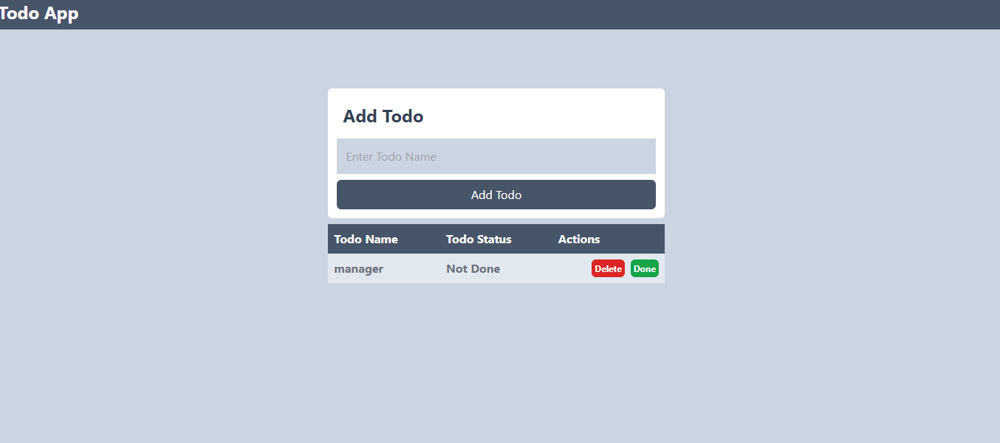
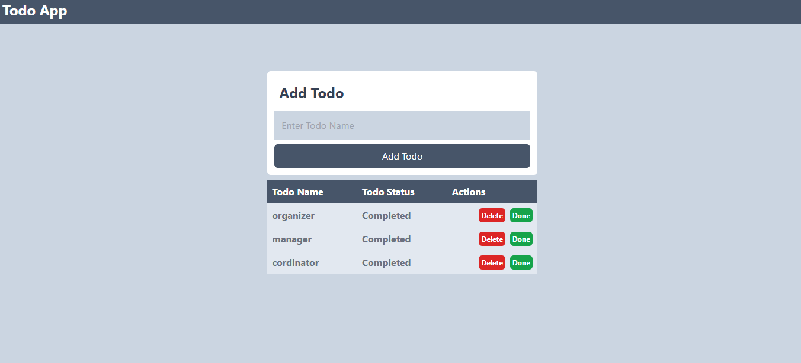

## Todo App

This is a simple Todo App built using HTML, CSS (Tailwind CSS), and JavaScript. It allows users to add, delete, and mark todos as done.

## Features

-**Add Todo**: Enter the name of the todo in the input
 field and click "Add Todo" to add it to the list.

-**Delete Todo**: Click on the "Delete" button to remove a todo from the list.

-**Mark as Done**: Click on the "Done" button to mark a todo as completed.

## How to Use
  **Clone the repository**.
  
  https://github.com/vpendo/Web-Application.git

-Open the **index.html** file in your web browser.

-Enter the todo name in the input field and click "Add Todo" to add it to the list.

-Click on the "Delete" button to remove a todo.

-Click on the "Done" button to mark a todo as completed.

## Dependencies

Tailwind CSS: A utility-first CSS framework for rapidly building custom designs.

## Author 

This Todo App is created by  **Vestine Pendo**